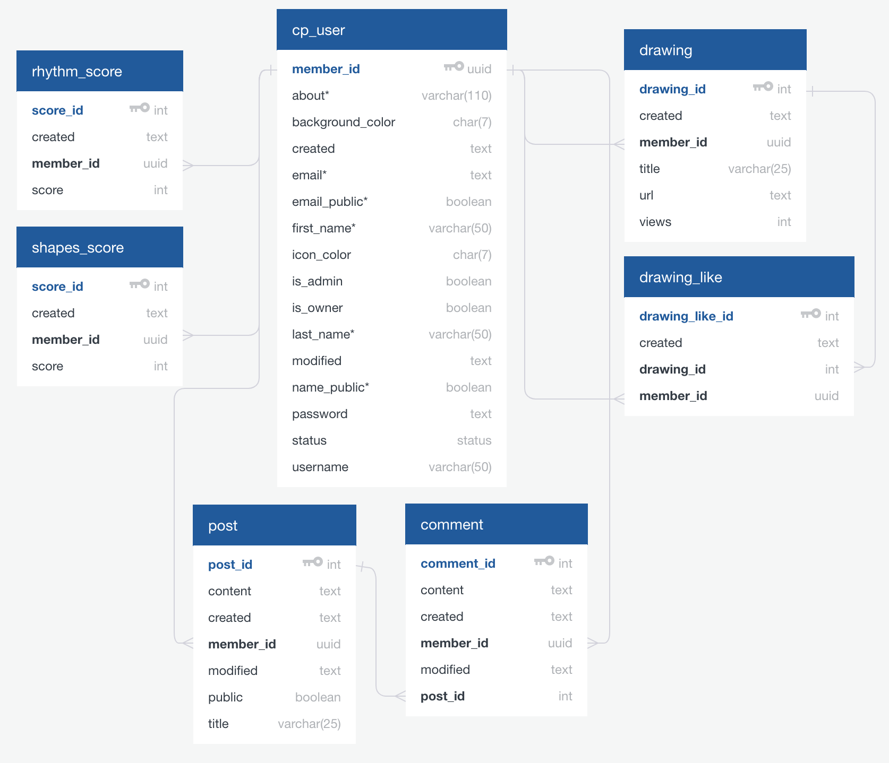

[](https://codecov.io/gh/estherh5/api.crystalprism.io)

# api.crystalprism.io
I started programming in January 2017 and am learning Python for back-end server development. api.crystalprism.io is the API for my website, [Crystal Prism](https://crystalprism.io). The API allows for the storage and retrieval of game scores, user-created drawings and thought posts, as well as user accounts. For user security, I implemented a JWT authentication flow from scratch that includes generating and verifying secure user tokens.

## Setup
To create your own copy of the Crystal Prism API, first clone this repository on your server. Next, install requirements by running `pip install -r requirements.txt`. Create a PostgreSQL database to store user information, as well as a user that has all privileges on your database. Create an Amazon S3 bucket with separate folders for storing database backup files, homepage photos, and CanvaShare drawings. Create an AWS user with keys for accessing your bucket. Set the following environment variables for the API:
* "SECRET_KEY" for the salt used to generate the signature portion of the JWT for user authentication (set this as a secret key that only you know; it is imperative to keep this private for user account protection)
* "ENV_TYPE" for the environment status (set this to "Dev" for testing or "Prod" for live)
* "VIRTUAL_ENV_NAME" for the name of your virtual environment (e.g., 'crystalprism'); this is used to schedule automatic database backups with crontab
* "PATH" for the path to the executable files that will run when automatic database backups are performed via crontab; you should append the path to your PostgreSQL directory here (e.g., "$PATH:/Applications/Postgres.app/Contents/Versions/latest/bin")
* ["AWS_ACCESS_KEY_ID"](http://boto3.readthedocs.io/en/latest/guide/configuration.html#environment-variables) for the access key for your AWS account stored on Amazon S3 buckets
* ["AWS_SECRET_ACCESS_KEY"](http://boto3.readthedocs.io/en/latest/guide/configuration.html#environment-variables) for the secret key for your AWS account stored on Amazon S3 buckets
* "S3_BUCKET" for the name of your S3 bucket (e.g., 'crystalprism')
* "S3_URL" for the URL for your S3 bucket (e.g., 'https://s3.us-east-2.amazonaws.com/crystalprism/')
* "S3_PHOTO_DIR" for the name of the S3 bucket's folder for photos (e.g., 'photos/')
* "S3_CANVASHARE_DIR" for the name of the S3 bucket's folder for CanvaShare drawings (e.g., 'canvashare/')
* "S3_BACKUP_DIR" for the name of the S3 bucket's folder for database backups (e.g., 'db-backups/')
* "BACKUP_DIR" for the directory where your database backups are stored locally
* "DB_CONNECTION" for the [dsn parameter string](http://initd.org/psycopg/docs/module.html) to connect to your database via psycopg2 (e.g., 'dbname=<database_name> user=<database_user> password=<database_user_password> host=<database_host>')
* "DB_NAME" for the name of your database
* "DB_USER" for the user who has all privileges on your database

Initialize the database by running `python management.py init_db`, and load initial data (webpage owner user, admin user, how-to Thought Writer posts, sample drawing) by running `python management.py load_data`. Set up weekly backups for the database by running `python management.py sched_backup`. Start the server by running `flask run` (if you are making changes while the server is running, enter `flask run --reload` instead for instant updates).

## API Status
To check if the API is online, a client can send a request to the following endpoint.

**GET** /api/ping
* Retrieve a success message if the server is online. No bearer token is needed in the request Authorization header.
* Example response body:
```javascript
Success
```

## CanvaShare API
#### March 2017 - Present
[CanvaShare](https://crystalprism.io/canvashare/index.html) is a community drawing gallery that lets users create drawings and post them to a public gallery. Each user has a folder on the server for their drawings, as well as a folder for the drawing's attributes (title, number of likes, number of views, list of liked users). Drawings are stored as PNG files with numeric file names (*1.png*, *2.png*, etc.), and drawing information files are stored as JSON files with the same numeric file names (*1.json*, *2.json*, etc.).

**POST** /api/canvashare/drawing
* Post a drawing by sending the jsonified drawing data URI in base64 format and drawing title in the request body. Note that there must be a verified bearer token in the request Authorization header.
* Example request body:
```javascript
{
    "drawing": "data:image/png;base64,iVBORw0KGgoAAAANSUhEUgAAAZ...",
    "title": "Welcome"
}
```

**GET** /api/canvashare/drawing/[artist]/[drawing_file]
* Retrieve an artist's drawing PNG file by specifying the artist's username and the drawing file name (e.g., *1.png*) in the request URL. No bearer token is needed in the request Authorization header.
* Example response body:<br />


**PATCH** /api/canvashare/drawing-info/[artist]/[drawing_id]
* Update a drawing's attributes by specifying the artist's username and the drawing file name without the extension (e.g., *1*) in the request URL. Send the jsonified attribute request ("like", "unlike", "view") in the request body. Note that there must be a verified bearer token in the request Authorization header.
* Example response body:
```javascript
{
    "request": "view"
}
```

**GET** /api/canvashare/drawing-info/[artist]/[drawing_id]
* Retrieve an artist's drawing's attributes by specifying the artist's username and the drawing file name without the extension (e.g., *1*) in the request URL. No bearer token is needed in the request Authorization header.
* Example response body:
```javascript
{
    "liked_users": [
      "esther"
    ],
    "likes": 1,
    "timestamp": "2017-10-05T00:00:00.000000+00:00",
    "title": "Welcome",
    "views": 0
}
```

**GET** /api/canvashare/gallery?start=[request_start]&end=[request_end]
* Retrieve all users' drawing file paths in the format "[artist]/[drawing_id].png", in order of newest to oldest drawings. Optionally specify the number of drawings via the request URL's start and end query parameters. No bearer token is needed in the request Authorization header.
* Example response body:
```javascript
{
    [
      "user/3.png",
      "esther/12.png",
      "esther/11.png",
      "esther/10.png",
      "user/2.png",
      "esther/9.png",
      "esther/8.png",
      "esther/7.png",
      "esther/6.png",
      "esther/5.png",
      "user/1.png"
    ]
}
```

**GET** /api/canvashare/gallery/[artist]?start=[request_start]&end=[request_end]
* Retrieve all of a single user's drawing file paths in the format "[artist]/[drawing_name].png", in order of newest to oldest drawings, by specifying the artist's username in the request URL. Optionally specify the number of drawings via the request URL's start and end query parameters. No bearer token is needed in the request Authorization header.
* Example response body:
```javascript
{
    [
      "esther/14.png",
      "esther/13.png",
      "esther/12.png",
      "esther/11.png",
      "esther/10.png",
      "esther/9.png",
      "esther/8.png",
      "esther/7.png",
      "esther/6.png",
      "esther/5.png",
      "esther/4.png"
    ]
}
```

## Rhythm of Life API
#### July 2017 - Present
[Rhythm of Life](https://crystalprism.io/rhythm-of-life/index.html) is an educational take on the classic game Snake, involving moving a heart to avoid stressors and seek relievers to maintain a healthy blood pressure. Rhythm of Life information is stored in the "rhythm_score" database table:


**POST** /api/rhythm-of-life/score
* Post a score by sending the jsonified score in the request body. Note that there must be a verified bearer token in the request Authorization header.
* Example request body:
```javascript
{
    "score": 91
}
```

**GET** /api/rhythm-of-life/score/[score_id]
* Retrieve a score by sending the score id in the request URL. No bearer token is needed in the request Authorization header.
* Example response body:
```javascript
{
    "created": "2017-10-27T04:00:51.122Z",
    "score": 91,
    "score_id": 12,
    "username": "esther"
},
```

**DELETE** /api/rhythm-of-life/score/[score_id]
* Delete a score by sending the score id in the request URL. Note that there must be a verified bearer token for the player in the request Authorization header.

**GET** /api/rhythm-of-life/scores?start=[request_start]&end=[request_end]
* Retrieve all users' game scores, in order of highest to lowest score. Optionally specify the number of scores via the request URL's start and end query parameters. No bearer token is needed in the request Authorization header.
* Example response body:
```javascript
[
    {
      "created": "2017-10-27T04:00:51.122Z",
      "score": 91,
      "score_id": 12,
      "username": "esther"
    },
    {
      "created": "2017-10-27T03:54:50.401Z",
      "score": 23,
      "score_id": 10,
      "username": "esther"
    },
    {
      "created": "2017-10-27T03:53:31.133Z",
      "score": 17,
      "score_id": 9,
      "username": "esther"
    },
    {
      "created": "2017-10-27T03:55:04.103Z",
      "score": 9,
      "score_id": 11,
      "username": "esther"
    },
    {
      "created": "2017-10-24T00:19:29.485Z",
      "score": 9,
      "score_id": 6,
      "username": "admin"
    }
]
```

**GET** /api/rhythm-of-life/scores/[player_name]?start=[request_start]&end=[request_end]
* Retrieve all of a single user's game scores, in order of highest to lowest score. Optionally specify the number of scores via the request URL's start and end query parameters. No bearer token is needed in the request Authorization header.
* Example response body:
```javascript
[
    {
      "created": "2017-10-27T04:00:51.122Z",
      "score": 91,
      "score_id": 12,
      "username": "esther"
    },
    {
      "created": "2017-10-27T03:54:50.401Z",
      "score": 23,
      "score_id": 10,
      "username": "esther"
    },
    {
      "created": "2017-10-27T03:53:31.133Z",
      "score": 17,
      "score_id": 9,
      "username": "esther"
    },
    {
      "created": "2017-10-27T03:55:04.103Z",
      "score": 9,
      "score_id": 11,
      "username": "esther"
    },
    {
      "created": "2017-10-27T03:50:14.098Z",
      "score": 8,
      "score_id": 8,
      "username": "esther"
    }
]
```

## Thought Writer API
#### August 2017 - Present
[Thought Writer](https://crystalprism.io/thought-writer/index.html) is a community post board for users to post short ideas for others to read and comment on.

**POST** /api/thought-writer/post
* Post a thought post by sending the jsonified post content, title, and public status ("true" or "false") in the request body. Note that there must be a verified bearer token in the request Authorization header.
* Example request body:
```javascript
{
    "content": "I find inspiration in the colors outside.",
    "public": false,
    "title": "The Beauty of Design"
}
```

**PATCH** /api/thought-writer/post
* Update a thought post by sending the jsonified post content, post creation timestamp (UTC), title, and public status (*true* or *false*) in the request body. Note that there must be a verified bearer token in the request Authorization header.
* Example request body:
```javascript
{
    "content": "I often find inspiration in the color combinations found in nature.",
    "created": "2017-11-05T02:21:35.017651+00:00",
    "public": true,
    "title": "The Beauty of Design"
}
```

**DELETE** /api/thought-writer/post
* Delete a thought post by sending the jsonified post creation timestamp (UTC) in the request body. Note that there must be a verified bearer token in the request Authorization header.
* Example request body:
```javascript
{
    "created": "2017-11-05T02:21:35.017651+00:00"
}
```

**GET** /api/thought-writer/post/[writer_name]/[post_timestamp]
* Retrieve a user's thought post by specifying the writer's username and the thought post's URI-encoded creation timestamp (UTC) in the request URL. Note that there must be a verified bearer token in the request Authorization header for a private post to be retrieved.
* Example response body:
```javascript
{
    "comments": [
      {
        "username": "esther",
        "content": "Thanks for welcoming me!",
        "timestamp": "2017-11-05T02:50:01.392277+00:00"
      }
    ],
    "content": "Welcome to Thought Writer, a community post board for you to write your ideas for the world to see. You can also create your own private posts or comment on others' posts. Click the yellow paper icon to get started!",
    "created": "2017-10-05T00:00:00.000000+00:00",
    "title": "Welcome",
    "username": "user"
}
```

**POST** /api/thought-writer/comment/[writer_name]/[post_timestamp]
* Post a comment to a thought post by specifying the post writer's username and the thought post's URI-encoded creation timestamp (UTC) in the request URL, as well as the jsonified comment content in the request body. Note that there must be a verified bearer token in the request Authorization header.
* Example request body:
```javascript
{
    "content": "I really like this post."
}
```

**PATCH** /api/thought-writer/comment/[writer_name]/[post_timestamp]
* Update a comment to a thought post by specifying the post writer's username and the thought post's URI-encoded creation timestamp (UTC) in the request URL, as well as the jsonified comment content and original comment creation timestamp (UTC) in the request body. Note that there must be a verified bearer token in the request Authorization header.
* Example request body:
```javascript
{
    "content": "I really like this post. Great writing!",
    "created": "2017-11-05T02:47:21.744277+00:00"
}
```

**DELETE** /api/thought-writer/comment/[writer_name]/[post_timestamp]
* Delete a comment to a thought post by specifying the post writer's username and the thought post's URI-encoded creation timestamp (UTC) in the request URL, as well as the jsonified comment creation timestamp (UTC) in the request body. Note that there must be a verified bearer token in the request Authorization header.
* Example request body:
```javascript
{
    "created": "2017-11-05T02:47:21.744277+00:00"
}
```

**GET** /api/thought-writer/post-board?start=[request_start]&end=[request_end]
* Retrieve all users' public thought posts. Optionally specify the number of thought posts via the request URL's start and end query parameters. No bearer token is needed in the request Authorization header.
* Example response body:
```javascript
[
    {
      "comments": [],
      "content": "<font color=\"#00c6fc\"><b>Only when you find yourself can you understand the world and your place within it. To deny oneself would be to have a limited view of the world, as you yourself are part of it not only in perception but in external interfacing and influence.</b></font>",
      "created": "2017-10-27T04:31:07.730128+00:00",
      "title": "Finding yourself",
      "username": "esther"
    },
    {
      "comments": [
        {
          "username": "esther",
          "content": "Thanks for welcoming me!",
          "created": "2017-11-05T02:50:01.392277+00:00"
        }
      ],
      "content": "Welcome to Thought Writer, a community post board for you to write your ideas for the world to see. You can also create your own private posts or comment on others' posts. Click the yellow paper icon to get started!",
      "created": "2017-10-05T00:00:00.000000+00:00",
      "title": "Welcome",
      "username": "user"
    }
]
```

**GET** /api/thought-writer/post-board/[writer_name]?start=[request_start]&end=[request_end]
* Retrieve all of a single user's thought posts by specifying the writer's username in the request URL. Optionally specify the number of thought posts via the request URL's start and end query parameters. If there is a verified bearer token for the writer in the request Authorization header, the server will send the user's private and public posts; otherwise, only the public posts will be sent.
* Example response body:
```javascript
{
    "comments": [],
    "content": "<font color=\"#00c6fc\"><b>Only when you find yourself can you understand the world and your place within it. To deny oneself would be to have a limited view of the world, as you yourself are part of it not only in perception but in external interfacing and influence.</b></font>",
    "public": true,
    "created": "2017-10-27T04:31:07.730128+00:00",
    "title": "Finding yourself"
}
```

## Shapes in Rain API
#### September 2017 - Present
[Shapes in Rain](https://crystalprism.io/shapes-in-rain/index.html) is a game in which random shapes appear periodically on the page for a user to clear with a click. Shapes in Rain information is stored in the "shapes_score" database table:


**POST** /api/shapes-in-rain/score
* Post a score by sending the jsonified score in the request body. Note that there must be a verified bearer token in the request Authorization header.
* Example request body:
```javascript
{
    "score": 30
}
```

**GET** /api/shapes-in-rain/score/[score_id]
* Retrieve a score by sending the score id in the request URL. No bearer token is needed in the request Authorization header.
* Example response body:
```javascript
{
    "created": "2017-10-24T00:00:23.591Z",
    "score": 30,
    "score_id": 6,
    "username": "esther"
},
```

**DELETE** /api/shapes-in-rain/score/[score_id]
* Delete a score by sending the score id in the request URL. Note that there must be a verified bearer token for the player in the request Authorization header.

**GET** /api/shapes-in-rain/scores?start=[request_start]&end=[request_end]
* Retrieve all users' game scores, in order of highest to lowest score. Optionally specify the number of scores via the request URL's start and end query parameters. No bearer token is needed in the request Authorization header.
* Example response body:
```javascript
[
    {
      "created": "2017-10-29T00:10:35.382Z",
      "score": 150,
      "score_id": 20,
      "username": "esther"
    },
    {
      "created": "2017-10-28T08:11:34.113Z",
      "score": 95,
      "score_id": 18,
      "username": "admin"
    },
    {
      "created": "2017-10-20T00:00:23.591Z",
      "score": 30,
      "score_id": 6,
      "username": "esther"
    },
    {
      "created": "2017-10-24T08:30:10.296Z",
      "score": 29,
      "score_id": 11,
      "username": "esther"
    },
    {
      "created": "2017-10-23T09:24:50.404Z",
      "score": 28,
      "score_id": 9,
      "username": "admin"
    }
]
```

**GET** /api/shapes-in-rain/scores/[player_name]?start=[request_start]&end=[request_end]
* Retrieve all of a single user's game scores, in order of highest to lowest score. Optionally specify the number of scores via the request URL's start and end query parameters. No bearer token is needed in the request Authorization header.
* Example response body:
```javascript
[
    {
      "created": "2017-10-29T00:10:35.382Z",
      "score": 150,
      "score_id": 20,
      "username": "esther"
    }
    {
      "created": "2017-10-20T00:00:23.591Z",
      "score": 30,
      "score_id": 6,
      "username": "esther"
    },
    {
      "created": "2017-10-24T08:30:10.296Z",
      "score": 29,
      "score_id": 11,
      "username": "esther"
    }
]
```

## User Account API
#### September 2017 - Present
Users who want to join the Crystal Prism community can create an account to store their Shapes in Rain and Rhythm of Life scores, their CanvaShare drawings, and their Thought Writer posts. User information is stored in the "cp_user" database table:


**POST** /api/user
* Create a user account by sending the jsonified username and password in the request body.
* Example request body:
```javascript
{
    "password": "password"
    "username": "username",
}
```

**GET** /api/user
* Retrieve a user's complete account information. Note that there must be a verified bearer token for the user in the request Authorization header.
* Example response body:
```javascript
{
    "about": "", // User-entered blurb that appears on public profile
    "background_color": "#ffffff", // User-chosen background color of public profile
    "created": "2017-10-04T00:00:00.000Z", // UTC timestamp of when user account was created
    "comment_count": 1, // Number of post comments user has created
    "drawing_count": 1, // Number of drawings user has created
    "drawing_like_count": 1, // Number of drawings user has liked
    "email": "", // User-entered on My Account page
    "email_public": false, // User specifies if email is viewable on public profile
    "first_name": "", // User-entered on My Account page
    "icon_color": "#000000", // User-chosen icon color of public profile
    "is_admin": true, // Admin status
    "last_name": "", // User-entered on My Account page
    "name_public": false, // User specifies if name is viewable on public profile
    "post_count": [], // Number of posts user has created
    "rhythm_high_score": 0, // User's high score for Rhythm of Life
    "rhythm_score_count": 0, // Number of times user has played Rhythm of Life
    "shapes_high_score": 0, // User's high score for Shapes in Rain
    "shapes_score_count": 0, // Number of times user has played Shapes in Rain
    "status": "active", // Can be active or deleted
    "username": "admin" // Case-sensitive username
}
```

**PATCH** /api/user
* Update a user's account information by specifying the jsonified account updates in the request body. Note that there must be a verified bearer token for the user in the request Authorization header.
* Example request body:
```javascript
{
    "about": "Founder of Crystal Prism",
    "background_color": "#9fffad",
    "email": "",
    "email_public": false,
    "first_name": "",
    "icon_color": "#ffb4e6",
    "last_name": "",
    "password": "",
    "name_public": false,
    "username": "esther"
}
```

**DELETE** /api/user
* Soft-delete a user's account as the user (i.e., change the account's status to "deleted" while leaving drawings, posts, scores, personal information, etc. intact, in case the user wants to reactivate the account). Note that there must be a verified bearer token for the user in the request Authorization header.

**GET** /api/user/[username]
* Retrieve a user's public account information. No bearer token is needed in the request Authorization header.
* Example response body:
```javascript
{
    "about": "",
    "created": "2017-10-04T00:00:00.000Z",
    "background_color": "#ffffff",
    "comment_count": 0,
    "drawing_count": 1,
    "drawing_like_count": 0,
    "email": "admin@crystalprism.io",
    "icon_color": "#000000",
    "is_admin": true,
    "post_count": 0,
    "rhythm_high_score": 0,
    "rhythm_score_count": 0,
    "shapes_high_score": 0,
    "shapes_score_count": 0,
    "status": "active",
    "username": "admin"
}
```

**DELETE** /api/user/[username]
* Hard-delete a user's account as the user or as an admin user (i.e., delete all of the user's drawings, posts, scores, personal information, etc. in addition to changing the account status to "deleted"). Note that there must be a verified bearer token for the user or for an admin user in the request Authorization header.

**GET** /api/user/verify
* Check if a bearer token in a request Authorization header is valid and receive the expiration time (in seconds since epoch) if so.
* Example response body:
```javascript
{
    "exp": 1509855369,
    "username": "esther"
}
```

**GET** /api/users?start=[request_start]&end=[request_end]
* Retrieve all users' usernames. Optionally specify the number of users via the request URL's start and end query parameters. Note that there must be a verified bearer token in the request Authorization header.
* Example response body:
```javascript
[
    "esther",
    "user"
]
```

**GET** /api/login
* Check if a username and password in a request Authorization header match the username and password stored for a user account and receive a [JSON Web Token](https://jwt.io/) if so. The JWT is set to expire after 1 hour.
* Example response body:
```javascript
{
    "token": "eyJhbGciOiAiSFMyNTYiLCAidHlwIjogIkpXVC..."
}
```

## Amazon S3 API
#### February 2018 - Present
The Crystal Prism homepage has a Photos page that features photos I have taken that are stored in an Amazon S3 bucket. I use boto3 to initiate an s3 bucket resource and query the bucket to return a list of all the stored photo objects. Note that the following environment variables must be set:
  - ["AWS_ACCESS_KEY_ID"](http://boto3.readthedocs.io/en/latest/guide/configuration.html#environment-variables) must be set to the access key for your AWS account
  - ["AWS_SECRET_ACCESS_KEY"](http://boto3.readthedocs.io/en/latest/guide/configuration.html#environment-variables) must be set to the secret key for your AWS account
  - "S3_BUCKET" must be set to the name of your S3 bucket (e.g., 'crystalprism')
  - "S3_PHOTO_DIR" must be set to the name of your S3 bucket's folder for photos (e.g., 'photos/')
  - "S3_URL" must be set as the URL for your S3 bucket (e.g., 'https://s3.us-east-2.amazonaws.com/crystalprism/')

**GET** /api/photos?start=[request_start]&end=[request_end]
* Retrieve URLs for photos stored in an S3 bucket. Optionally specify the number of photos via the request URL's start and end query parameters.
* Example response body:
```javascript
[
    'https://s3.us-east-2.amazonaws.com/crystalprism/photos/1.png',
    'https://s3.us-east-2.amazonaws.com/crystalprism/photos/10.png',
    'https://s3.us-east-2.amazonaws.com/crystalprism/photos/2.png',
    'https://s3.us-east-2.amazonaws.com/crystalprism/photos/3.png',
    'https://s3.us-east-2.amazonaws.com/crystalprism/photos/4.png',
    'https://s3.us-east-2.amazonaws.com/crystalprism/photos/5.png',
    'https://s3.us-east-2.amazonaws.com/crystalprism/photos/6.png',
    'https://s3.us-east-2.amazonaws.com/crystalprism/photos/7.png',
    'https://s3.us-east-2.amazonaws.com/crystalprism/photos/8.png',
    'https://s3.us-east-2.amazonaws.com/crystalprism/photos/9.png'
]
```

## Crystal Prism Database
#### February 2018 - Present
The Crystal Prism database is a PostgreSQL database that contains Crystal Prism user accounts and user data (game scores, drawings, posts, identifying information, etc.). The database is structured as follows:

Note that all fields in the database tables are required except for those denoted with an asterisk.
The database is set up to back up data every week and save the backup file to an Amazon S3 bucket. Note that the following environment variables must be set:
 - ["AWS_ACCESS_KEY_ID"](http://boto3.readthedocs.io/en/latest/guide/configuration.html#environment-variables) must be set to the access key for your AWS account
 - ["AWS_SECRET_ACCESS_KEY"](http://boto3.readthedocs.io/en/latest/guide/configuration.html#environment-variables) must be set to the secret key for your AWS account
 - "S3_BUCKET" must be set to the name of your S3 bucket (e.g., 'crystalprism')
 - "S3_BACKUP_DIR" must be set to the name of your S3 bucket's folder for database backups (the default is 'db-backups/')
 - "VIRTUAL_ENV_NAME" must be set to the name of your virtual environment (e.g., 'crystalprism')
 - "PATH" must be set to the path to the executable files that will run when automatic database backups are performed via crontab; you should append the path to your PostgreSQL directory here (e.g., "$PATH:/Applications/Postgres.app/Contents/Versions/latest/bin")
 - "BACKUP_DIR" must be set to the directory where your database backups are stored locally
